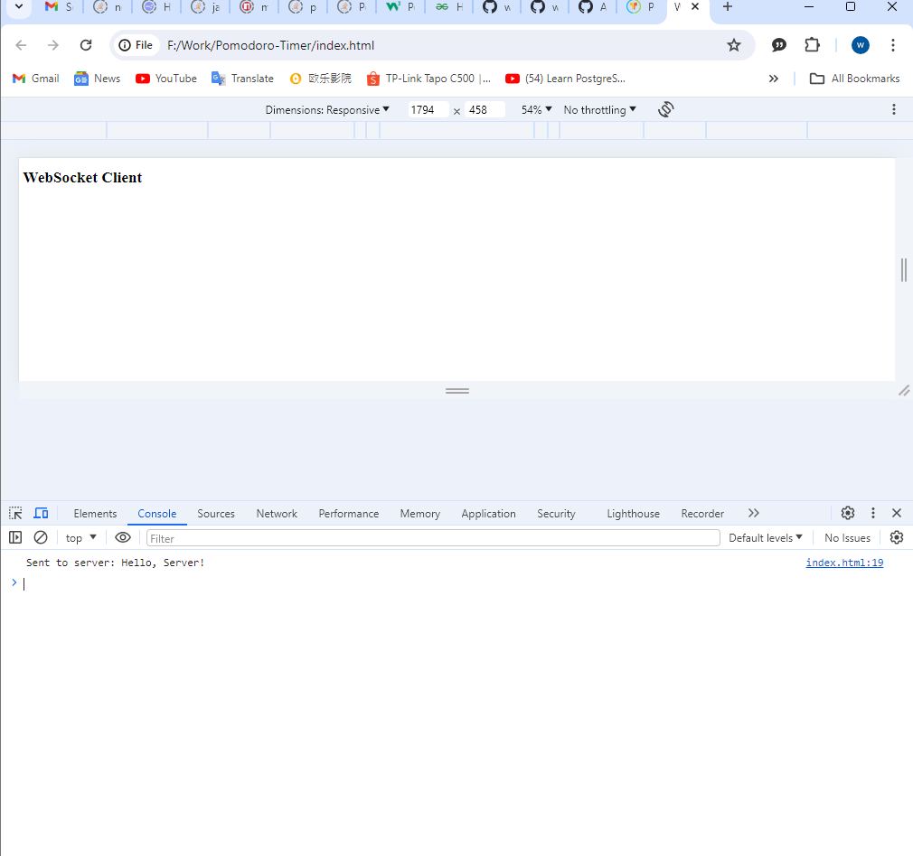
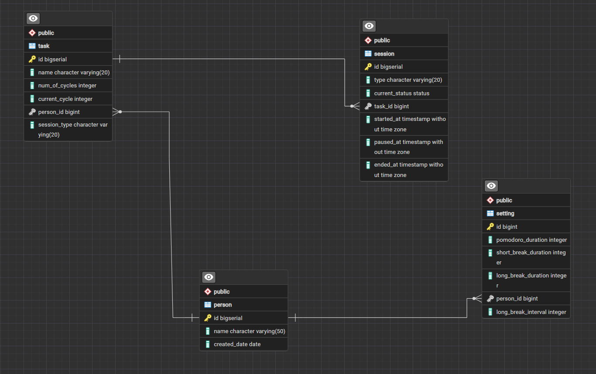

# Pomodoro-Timer

```bash
npm install

# serve app at localhost:3000
npm run dev
```

### Getting started

#### Prerequisites

1. Ensure you have [Node.js](https://nodejs.org/en/) installed.
2. Ensure you have the postgres DB setted up locally, can import it from the db file I send over.

#### Step-by-step

1. Clone this repository with command below, can copy and paste to your cmd.

```bash
git clone https://github.com/wng97/Pomodoro-Timer.git
```

2. Open up the folder in VS code

3. Install dependencies,

```bash
npm install
```

4. Run up the BackEnd,

```bash
npm run dev
```

5. Open up the index.html folder by using Google Chrome, its mainly use to display and perform the end to end process on its console as picture below.
<p align="center">
  
</p>

6. Can start playing around with the API, enjoy!

### API Design

There is total 6 API:

1. Start session API, POST request, you must create a task to trigger the api. Currently there is 2 task with id 1 and 3 in the given sample db. It will return a session id on the response, this is just for demo used only.

```bash
/task/:taskId/start
```

2. Pause session API, POST request, required two params, one is taskId another one is sessionId

```bash
/task/:taskId/pause/:sessionId
```

3. Resume session API, POST request, required two params, one is taskId another one is sessionId

```bash
/task/:taskId/resume/:sessionId
```

4. Retrieve status API, GET request, required one param, taskId.

```bash
/task/:taskId
```

5. Init setting API, POST request, required one param, personId. For request body, there is 4 value, pomodoro_duration, short_break_duration, long_break_duration, long_break_interval, but 4 of them its optional. If nothing is input i will default gave then 5 second for those three durations, and 2 for the long_break_interval Currently there's only one person with id 1 in the sample DB.

```bash
/setting/:personId
```

6. Update setting API, PUT request, required one param, settingId. For request body it will be similar to the init setting API but without the default values. Currently theres only one settings that tag to person with id 1.

```bash
/setting/:settingId
```

### Database Design

There is total 4 main entity and table as picture below:

<p align="center">
  
</p>

1. Let's start from person, person have a one to many relationship with the task, cause one person can have multiple task.

2. Person have a one to one relationship with the setting, one person can only have one set of setting.

3. Setting have a one to one relationship with the setting, one setting can only belongs to one person.

4. Task having a one to many relationship with the session. One task can have multiple session.
